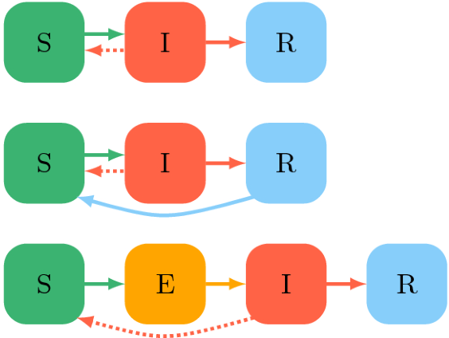
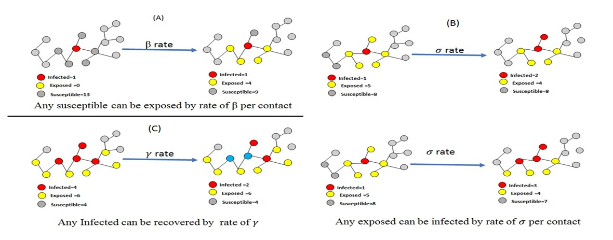

```{r include=FALSE}
library(igraph)
library(animation)
library(tidyverse)
library(dplyr)
library(gganimate)
library(ggplot2)
library(devtools)
SEIR_IE <- function(red, Beta, Gamma, Sigma, Infectados) {
  #SEIR IE es por Interacciones estáticas
  # Función para calcular R0
  Calcular_Ro <- function(beta, gamma) {
    Ro <- beta / gamma
    return(Ro)
  }
  
  # Cálculo de R0
  Ro <- Calcular_Ro(Beta, Gamma)
  cat("R0 =", Ro, "\n")
  
  # Validación de R0
  if (Ro <= 1) {
    cat("R0 es menor o igual a 1. La enfermedad no se propagará.\n")
    return(NULL) # Detenemos la ejecución de la función
  } else {
    cat("La simulación continuará.\n")
  }
  
  # Función para imprimir el estado de la red
  Imprimir_red <- function(red) {
    colores <- c("s" = "green", "E" = "yellow", "I" = "red", "R" = "blue")
    colores_nodos <- colores[V(red)$estado]
    plot(red, vertex.color = colores_nodos, main = "Estado de la red", vertex.size = 10)
  }
  
  # Definimos nnuestros estados iniciales
  V(red)$estado <- "s"
  Primeros_infectados <- sample(V(red), Infectados)
  V(red)[Primeros_infectados]$estado <- "I"
  
  Transicion_de_estados <- data.frame(tiempo = integer(), estado = character(), cantidad = integer())
  
  # Comenzamos con la siulación
  saveGIF({
    Imprimir_red(red)
    
    Primeros_estados <- table(V(red)$estado)
    data_primeros_estados <- as.data.frame(Primeros_estados) %>%
      rename(estado = Var1, cantidad = Freq) %>%
      mutate(tiempo = 0) #Para guardar los datos iniciales
    
    Transicion_de_estados <- bind_rows(Transicion_de_estados, data_primeros_estados)
    
    for (t in 1:100) {
      estado_anterior <- V(red)$estado
      
      for (nodo in 1:vcount(red)) {
        estado_actual <- estado_anterior[nodo]
        
        if (estado_actual == "s") {
          vecinos_infectados <- sum(estado_anterior[neighbors(red, nodo)] == "I")
          prob_infeccion <- 1 - (1 - Beta)^vecinos_infectados
          if (vecinos_infectados > 0 & runif(1) < prob_infeccion) {
            V(red)[nodo]$estado <- "E"
          }
        } else if (estado_actual == "E") {  # Transición entre los
          if (runif(1) < Sigma) {           # diferentes estados
            V(red)[nodo]$estado <- "I" 
          }
        } else if (estado_actual == "I") {
          if (runif(1) < Gamma) {
            V(red)[nodo]$estado <- "R"
          }
        }
      }
      
      Imprimir_red(red)
      
      conteo <- table(V(red)$estado)
      conteo_data <- as.data.frame(conteo) %>%
        rename(estado = Var1, cantidad = Freq) %>% # Guardamos los datos de las
                                                   # transiciones de estados
        mutate(tiempo = t)
      Transicion_de_estados <- bind_rows(Transicion_de_estados, conteo_data)
    }
    
  }, movie.name = "simulacion_seir.gif", interval = 0.2, ani.width = 600, ani.height = 600)
  
  #Con esto vemos la cantidad máxima de infectados
  # en el modelo
  
  
  # Graficamos a la población y como cambia de compartimento con respecto
  # al tiempo
  ggplot(Transicion_de_estados, aes(x = tiempo, y = cantidad, color = estado, group = estado)) +
    geom_line(linewidth = 1) + 
    scale_color_manual(values = c("s" = "green", "E" = "yellow", "I" = "red", "R" = "blue")) + 
    labs(title = "Modelo SEIR con conexiones estáticas",
         x = "Tiempo", y = "Población") +
    theme_minimal()  # + transition_reveal(tiempo)
                  # Esto ocupamucha memoria
 
}     
SEIR_ID <- function(red, Beta, Gamma, Sigma, Infectados) {
  # SEIR_ID es por Interacciones Dinámicas
  # Función para calcular R0
  Calcular_Ro <- function(beta, gamma) {
    Ro <- beta / gamma
    return(Ro)
  }
  
 
  Ro <- Calcular_Ro(Beta, Gamma)
  cat("R0 =", Ro, "\n")
  

  if (Ro <= 1) {
    cat("R0 es menor o igual a 1. La enfermedad no se propagará.\n")
    return(NULL) # Detenemos la ejecución de la función
  } else {
    cat("La simulación continuará.\n")
  }
  
  # Función para imprimir el estado de la red
  Imprimir_red <- function(red) {
    colores <- c("s" = "green", "E" = "yellow", "I" = "red", "R" = "blue")
    colores_nodos <- colores[V(red)$estado]
    plot(red, vertex.color = colores_nodos, main = "Estado de la red", vertex.size = 10)
  }
  
  # Configuración inicial
  V(red)$estado <- "s"
  Primeros_infectados <- sample(V(red), Infectados)
  V(red)[Primeros_infectados]$estado <- "I"
  
  Transicion_de_estados <- data.frame(tiempo = integer(), estado = character(), cantidad = integer())
  
  # Simulación y generación del GIF
  saveGIF({
    Imprimir_red(red)
    
    Primeros_estados <- table(V(red)$estado)
    data_primeros_estados <- as.data.frame(Primeros_estados) %>%
      rename(estado = Var1, cantidad = Freq) %>%
      mutate(tiempo = 0)
    
    Transicion_de_estados <- bind_rows(Transicion_de_estados, data_primeros_estados)
    
    for (t in 1:100) {
      red <- rewire(red, each_edge(p = 0.1)) 
      # esto es lo unico nuevo que se le añade
      # a la función para la reestructuración dinámica de la red
      estado_anterior <- V(red)$estado
      
      for (nodo in 1:vcount(red)) {
        estado_actual <- estado_anterior[nodo]
        
        if (estado_actual == "s") {
          vecinos_infectados <- sum(estado_anterior[neighbors(red, nodo)] == "I")
          prob_infeccion <- 1 - (1 - Beta)^vecinos_infectados
          if (vecinos_infectados > 0 & runif(1) < prob_infeccion) {
            V(red)[nodo]$estado <- "E"
          }
        } else if (estado_actual == "E") {
          if (runif(1) < Sigma) {
            V(red)[nodo]$estado <- "I"
          }
        } else if (estado_actual == "I") {
          if (runif(1) < Gamma) {
            V(red)[nodo]$estado <- "R"
          }
        }
      }
      
      Imprimir_red(red)
      
      conteo <- table(V(red)$estado)
      conteo_data <- as.data.frame(conteo) %>%
        rename(estado = Var1, cantidad = Freq) %>%
        mutate(tiempo = t)
      Transicion_de_estados <- bind_rows(Transicion_de_estados, conteo_data)
    }
    
  }, movie.name = "simulacion_seir.gif", interval = 0.2, ani.width = 600, ani.height = 600)
  
  # Graficar la transición de los estados a lo largo del tiempo
  ggplot(Transicion_de_estados, aes(x = tiempo, y = cantidad, color = estado, group = estado)) +
    geom_line(size = 1) + 
    scale_color_manual(values = c("s" = "green", "E" = "yellow", "I" = "red", "R" = "blue")) + 
    labs(title = "Modelo SEIR con conexiones dinámicas",
         x = "Tiempo", y = "Población") +
    theme_minimal()  #+ transition_reveal(tiempo)
 
}
DeterminaImax <- function(beta, gamma, poblacion){
  Ro <- beta/gamma
  fraccion <- 1- ((1 + (log(Ro)))/Ro)
  infectados <- fraccion * poblacion
  cat("La cantidad de infectados Max es", infectados, "aproximadamente")
}
```

## Introducción 

<p style="text-align:center;">(Dias et al, 2022)</p>
Los modelos por compartimentos son utilizados comunmente para representar la dinamica de enfermedades, una manera de representarlos graficamente es por redes las cuales representan un momento del tiempo (Craig et al ., 2020).

## Objetivo

<p style="text-align:center;">(Ameri & Cooper, 2019)</p>

Lo que se busca es poder generar una función que represente la dinamica de un modelo SEIRde manera gráfica a travez del cambio en una red que representa la población.

## Función
```{r eval=FALSE, include=TRUE}
SEIR_ID <- function(red, Beta, Gamma, Sigma, Infectados)
```
Primero se agregan las entradas necesarias para la función, en este caso son la red, las diferentes tasas y el numero de infectados


## Función
```{r eval=FALSE, include=TRUE}
  Ro <- Calcular_Ro(Beta, Gamma)
  cat("R0 =", Ro, "\n")
  if (Ro <= 1) {
    cat("R0 es menor o igual a 1. La enfermedad no se propagará.\n")
    return(NULL) 
  } else {
    cat("La simulación continuará.\n")
  }
```
Calculamos R0 para solo continuar la simulación en caso de que sea mayor a 1

## Función
```{r eval=FALSE, include=TRUE}
 Imprimir_red <- function(red) {
    colores <- c("s" = "green", "E" = "yellow", 
                 "I" = "red", "R" = "blue")
    colores_nodos <- colores[V(red)$estado]
    plot(red, vertex.color = colores_nodos, 
         main = "Estado de la red", vertex.size = 10)
  }
```
En esta sección se imprime el estado de la red, asignandole un color a cada compartimento dentro de la red

## Función 
```{r eval=FALSE, include=TRUE}
V(red)$estado <- "s"
  Primeros_infectados <- sample(V(red), Infectados)
  V(red)[Primeros_infectados]$estado <- "I"
  
  Transicion_de_estados <-
    data.frame(tiempo = integer(), 
               estado = character(), cantidad = integer())
```
En esta parte lo que se haces es definir los estados iniciales de Suceptibles e Infectados, así como la manera en la que se almacenan los datos del estado de la red

## Función 
```{r eval=FALSE, include=TRUE}
 saveGIF({
    Imprimir_red(red)
    
    Primeros_estados <- table(V(red)$estado)
    data_primeros_estados <- as.data.frame(Primeros_estados) %>%
      rename(estado = Var1, cantidad = Freq) %>%
      mutate(tiempo = 0)
    
    Transicion_de_estados <-
      bind_rows(Transicion_de_estados, data_primeros_estados)
```
A continuación lo que se hace es generar el gif, mostrando la red original. Aquí también se define como se almancenan los datos del cambio en la red

## Función
```{r eval=FALSE, include=TRUE}
 for (t in 1:100) {
      red <- rewire(red, each_edge(p = 0.1)) 
```
Esta sección es solo pare el caso de conexiones dinamecas para reestructurar la red


```{r eval=FALSE, include=TRUE}
for (t in 1:100) {
      estado_anterior <- V(red)$estado
      
      for (nodo in 1:vcount(red)) {
        estado_actual <- estado_anterior[nodo]
```
En esta sección se realizan ciclos for para poder observar el estado de los nodos presentes

## Función

```{r eval=FALSE, include=TRUE}
 if (estado_actual == "s") {
          vecinos_infectados <- 
            sum(estado_anterior[neighbors(red, nodo)] == "I")
          prob_infeccion <- 1 - (1 - Beta)^vecinos_infectados
          if (vecinos_infectados > 0 & runif(1) < prob_infeccion) {
            V(red)[nodo]$estado <- "E"
          }
        } else if (estado_actual == "E") {  # Transición entre los
          if (runif(1) < Sigma) {           # diferentes estados
            V(red)[nodo]$estado <- "I" 
          }
        } else if (estado_actual == "I") {
          if (runif(1) < Gamma) {
            V(red)[nodo]$estado <- "R"
```
En esta sección se expresan las condiciones para el cambio de estado

## Función 
```{r eval=FALSE, include=TRUE}
 conteo <- table(V(red)$estado)
    conteo_data <- as.data.frame(conteo) %>% 
      rename(estado = Var1, cantidad = Freq) %>% 
      mutate(tiempo = t)
    Transicion_de_estados <- bind_rows(Transicion_de_estados, conteo_data)
  }
}, movie.name = "simulacion_seir.gif", 
interval = 0.2, ani.width = 600, ani.height = 600)
```
Se guarda la información de los conteos y la información de los cambios de transición

## Función
```{r eval=FALSE, include=TRUE}
ggplot(Transicion_de_estados, aes(x = tiempo, 
                                  y = cantidad, color = estado, 
                                  group = estado)) +
  geom_line(size = 1) +  # Dibuja las líneas
  scale_color_manual(values = c("s" = "green", 
                                "E" = "yellow", "I" = "red", "R" = "blue")) +  # Asigna colores a los estados
  labs(title = "Modelo SEIR con conexiones estáticas",
       x = "Tiempo", y = "Cantidad de nodos") +
  theme_minimal() + transition_reveal(tiempo)
```
Finalmente se grafica el cambio de la población con respecto al tiempo


## Ejemplos
Red club de Zachary
```{r}
Karate<-make_graph("Zachary")
plot(Karate)
vcount(Karate
       )
SEIR_IE(Karate, 0.2, 0.05, 0.5, 1)
DeterminaImax(0.2, 0.05, 34)
```

## Ejemplos
Red club de Zachary
```{r}
plot(Karate)
SEIR_ID(Karate, 0.2, 0.05, 0.5, 1)
```


## Ejemplos
Red Barabasi
```{r}
red44 <- sample_pa(100, directed = F)
plot(red44)

SEIR_IE(red44, 0.1, 0.05, 0.5, 5)
```

```{r}
plot(red44)

SEIR_ID(red44, 0.1, 0.05, 0.5, 5)
```


## Bibliografía
1. Dias, S., Queiroz, K., & Araujo, A. (2022). Introduction to group-structured-epidemic model. Journal of Control, Automation and Electrical Systems, 33, 23-37.

2. Craig, B. R., Phelan, T., Siedlarek, J. P., & Steinberg, J. (2020). Improving epidemic modeling with networks. Economic Commentary, (2020-23).

3. Ameri, K., & Cooper, K. D. (2019). A network-based compartmental model for the spread of whooping cough in Nebraska. AMIA Summits on Translational Science Proceedings, 2019, 388.

4. Rodrigo (2020). Crear gift con R. https://cienciadedatos.net/documentos/57_gif_con_r.html
